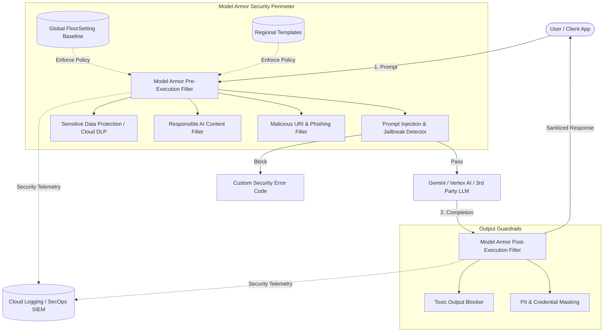

# Model Armor - Enterprise AI & LLM Security Guardrails

[](README.md)
[](LICENSE)
[](https://cloud.google.com/security/products/model-armor)
[](docs/gcc_security_guidelines.md)
[](requirements.txt)

---
**Author:** Joabson Saccomani ([@jsaccomani](https://github.com/g-jsaccomani))
**Role:** Cloud Security Consultant
**LinkedIn:** [linkedin.com/in/jsaccomani](https://www.linkedin.com/in/jsaccomani)
*Copyright © 2026 Google LLC / Joabson Saccomani. All rights reserved. Distributed under the Apache License 2.0.*

---

## Overview

**Model Armor** is Google Cloud's centralized, LLM-agnostic runtime defense and security guardrail framework for Generative AI applications, Large Language Models (LLMs), and Autonomous AI Agents.

This repository provides an enterprise-ready blueprint, Infrastructure as Code (Terraform), declarative security policies, a Python SDK interceptor, and an automated red-teaming benchmark suite adhering to **Google Cloud Consulting (GCC) Security** standards and the **OWASP Top 10 for LLM Applications**.

---

## Architecture



---

## Repository Structure

```text
model_armor/
 policies/               # Declarative Model Armor policy manifests & DLP specs
    floor_setting_enterprise_baseline.json
    template_strict_guardrail.json
    template_balanced_developer.json
    template_customer_facing.json
    dlp_inspect_template.json
    dlp_deidentify_template.json
 guardrails/             # Python Client SDK & Gemini Middleware
    __init__.py
    client.py           # Model Armor REST / Regional API client
    interceptor.py      # Gemini & Vertex AI middleware decorator
    cli.py              # CLI tool for testing & template management
 defense/                # Defense-in-depth security modules
    __init__.py
    canary.py           # Cryptographic system prompt leak detector
    heuristic_filter.py # Local signature & obfuscation pre-screener
    tool_firewall.py    # Agentic function/tool calling firewall
 evals/                  # Red-teaming dataset & benchmark runner
    datasets/
       prompt_injections.json
       pii_exfiltration.json
       malicious_uris.json
    runner.py           # Automated evaluation & metrics generator
 terraform/              # Infrastructure as Code (Terraform) modules
    main.tf
    variables.tf
    outputs.tf
    terraform.tfvars.example
 scripts/                # Fast setup and testing automation
    setup_gcp_model_armor.sh
    test_live_sanitization.sh
    demo_gemini_with_guardrail.py
 docs/                   # GCC Security & Architecture documentation
    architecture.md
    gcc_security_guidelines.md
    lab_guide.md
 requirements.txt
 pyproject.toml
 README.md
```

---

## Quickstart & Hands-On Lab

### 1. Interactive Onboarding Journey (Recommended)
Launch the interactive onboarding wizard to configure and provision Model Armor in any GCP project:
```bash
make journey
# or
./model-armor-journey
```

### 2. Fast Automated GCP Provisioning (Script)
Set up the Model Armor API, global FloorSettings, and guardrail template directly via shell:
```bash
./scripts/setup_gcp_model_armor.sh <YOUR_PROJECT_ID> us-central1 secops-guardrail-default
```

### 3. Interactive Sanitization Test
Verify real-time protection against adversarial injections and jailbreaks:
```bash
make sanitize-test
# or
./scripts/test_live_sanitization.sh <YOUR_PROJECT_ID>
```

### 4. Run the Red-Teaming Benchmark Suite
Execute the automated evaluation suite against live GCP Model Armor:
```bash
make evals
# or
python3 -m evals.runner --project=<YOUR_PROJECT_ID> --template=secops-guardrail-default
```

---

## Python SDK & Gemini Middleware Integration

Protect any Gemini or Vertex AI application with Model Armor in just a few lines of code:

### Decorator Pattern:
```python
from guardrails.interceptor import guardrail_protected

@guardrail_protected(template_id="secops-guardrail-default", location="us-central1")
def ask_gemini(prompt: str) -> str:
    # Model Armor automatically sanitizes prompt before execution
    # and validates model completion before returning
    return gemini_client.models.generate_content(
        model="gemini-2.0-flash",
        contents=prompt
    ).text
```

### Direct Middleware Usage:
```python
from guardrails.client import ModelArmorClient
from guardrails.interceptor import GeminiGuardrailInterceptor

client = ModelArmorClient(project_id="my-security-project-id", location="us-central1")
interceptor = GeminiGuardrailInterceptor(client=client, template_id="secops-guardrail-default")

# Inspect user input
try:
    clean_prompt = interceptor.inspect_prompt(user_prompt)
    raw_response = gemini_call(clean_prompt)
    clean_response = interceptor.inspect_response(raw_response)
    print(clean_response)
except Exception as e:
    print(f"Request blocked by Model Armor: {e}")
```

---

## Terraform Deployment

To deploy Model Armor using Terraform:

```bash
cd terraform
cp terraform.tfvars.example terraform.tfvars
# Edit terraform.tfvars with your project ID
terraform init
terraform plan
terraform apply
```

---

## Security & Compliance Standards

This repository aligns with:
- **Google Cloud Consulting (GCC) Security Baseline**
- **OWASP Top 10 for Large Language Model Applications (2025/2026)**
- **NIST AI Risk Management Framework (AI RMF 1.0)**
- **CIS Google Cloud Platform Foundation Benchmark**

For complete architecture specifications, see [docs/architecture.md](docs/architecture.md) and [docs/gcc_security_guidelines.md](docs/gcc_security_guidelines.md).

---

## Contributing & Security Vulnerabilities

- **Contributing**: Please review [CONTRIBUTING.md](CONTRIBUTING.md) and [CODE_OF_CONDUCT.md](CODE_OF_CONDUCT.md).
- **Security Vulnerabilities**: Review [SECURITY.md](SECURITY.md) for responsible disclosure. Do not open public issues for zero-day vulnerabilities.

---
**Author:** Joabson Saccomani ([@jsaccomani](https://github.com/g-jsaccomani))
**Role:** Cloud Security Consultant
**LinkedIn:** [linkedin.com/in/jsaccomani](https://www.linkedin.com/in/jsaccomani)
*Copyright © 2026 Google LLC / Joabson Saccomani. All rights reserved.*

<!-- Checkpoint: 2026-01-09 - docs(adversarial-tests): document adversarial robustness testing results for client validation -->

<!-- Checkpoint: 2026-01-28 - docs(adversarial-tests): document adversarial robustness testing results for client validation -->

<!-- Checkpoint: 2026-02-12 - sec(pii-redaction): fine-tune PII masking and redaction rules for customer healthcare LLM pipeline -->

<!-- Checkpoint: 2026-02-23 - docs(adversarial-tests): document adversarial robustness testing results for client validation -->
