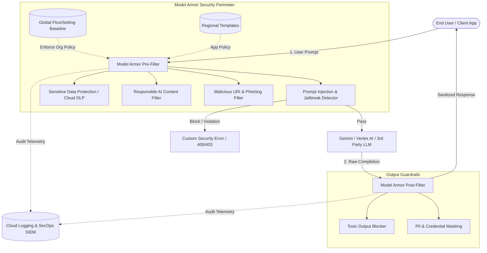

# Google Cloud Model Armor - Enterprise Reference Architecture

## 1. Executive Summary

**Model Armor** is Google Cloud's centralized, LLM-agnostic security guardrail and AI safety service. It enforces deterministic and heuristic security controls across Large Language Model (LLM) prompts, model completions, and autonomous agent workflows to mitigate risks associated with Generative AI applications.

---

## 2. Zero-Trust AI Architecture

---

## 3. Core Architecture Pillars

### 3.1 Dual-Tier Policy Hierarchy: FloorSettings vs. Templates

| Component | Scope | Primary Purpose | Governance |
| :--- | :--- | :--- | :--- |
| **FloorSettings** | Project / Organization (Global) | Enforces non-bypassable baseline security guardrails across all AI workloads in the organization. | Central SecOps / CISO Office |
| **Templates** | Application / Workload (Regional) | Tailored guardrail profiles matching specific application risk appetites and personas (e.g., Customer-Facing vs. Developer Assistant). | AI Platform Engineers & AppSec Teams |

### 3.2 Detection Engines & Capabilities

1. **Prompt Injection & Jailbreak Detection (`piAndJailbreakFilterSettings`)**:
   - Advanced machine learning classifiers detecting direct instruction overrides, role-play bypasses (DAN), delimiter confusion, and jailbreak techniques.
   - Configurable confidence thresholds (`LOW_AND_ABOVE`, `MEDIUM_AND_ABOVE`, `HIGH`).

2. **Malicious URI & Phishing Filter (`maliciousUriFilterSettings`)**:
   - Integrates Google Safe Browsing and Threat Intelligence to block phishing URLs, malware drop sites, and suspicious domains in prompts and completions.

3. **Responsible AI (RAI) Content Moderation (`raiSettings`)**:
   - Filters `HATE_SPEECH`, `HARASSMENT`, `SEXUALLY_EXPLICIT`, and `DANGEROUS` content across multiple confidence levels.

4. **Sensitive Data Protection & DLP (`sdpSettings`)**:
   - Integrates with Google Cloud Data Loss Prevention (Cloud DLP).
   - Supports Basic automated redaction and Advanced inspection / de-identification templates for custom InfoTypes (CPF, SSN, Credit Cards, API Keys, Tokens).

5. **Security Telemetry & Cloud Logging**:
   - Comprehensive audit logging for all sanitization requests and policy violations forwarded to Cloud Logging and Google Security Operations (Chronicle SIEM).

<!-- Checkpoint: 2025-12-17 - sec(pii-redaction): fine-tune PII masking and redaction rules for customer healthcare LLM pipeline -->

<!-- Checkpoint: 2026-02-27 - sec(pii-redaction): fine-tune PII masking and redaction rules for customer healthcare LLM pipeline -->

<!-- Checkpoint: 2026-03-27 - docs(adversarial-tests): document adversarial robustness testing results for client validation -->
